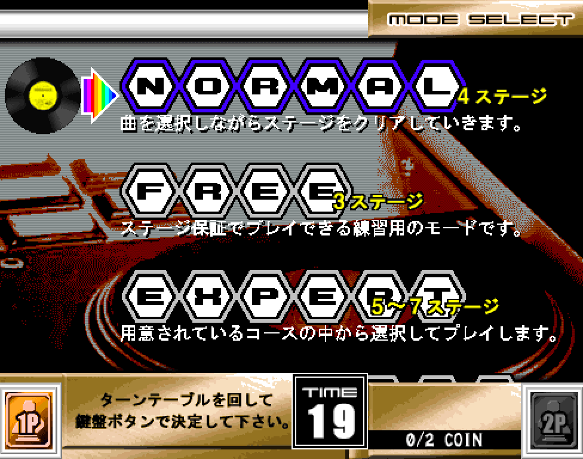
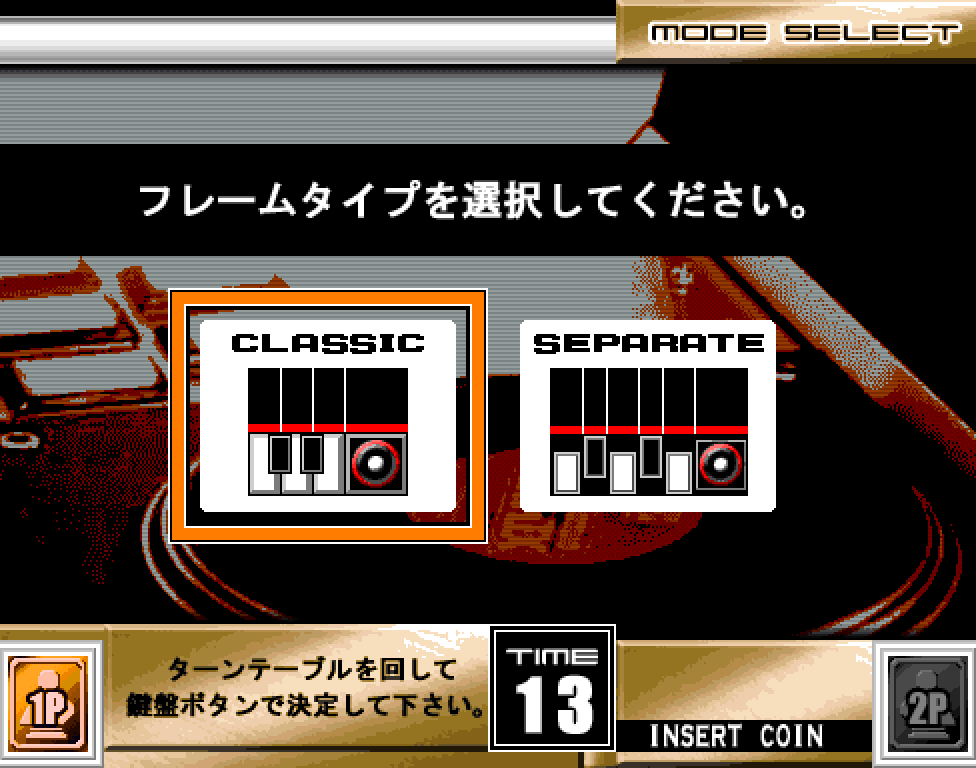
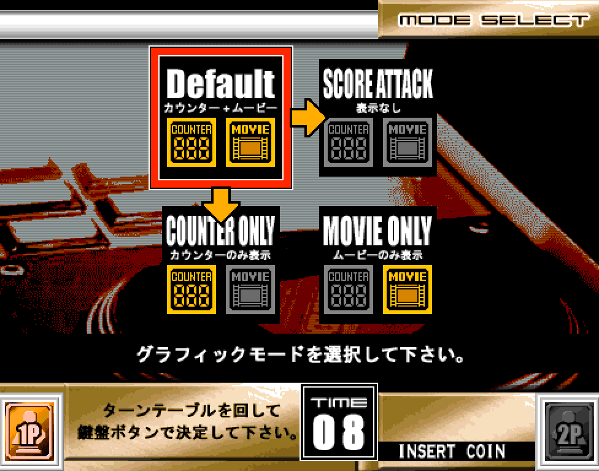

# Starting the game
{: .no_toc }

  

    Table of contents
  

  {: .text-delta }
1. TOC
{:toc}

## Playing the arcade game for the first time
By default, beatmania requires 2 coins to start a 1 player game, and 4 coins to start a 2 player game. These can vary between whoever owns the cabinet, and their choice in machine settings (it may cost more, less, or be on free play). 

Unlike with IIDX, you cannot pick which side you play on alone: starting a 1 player game will always put you onto the 1P side. To start a 1 player credit, press the 1P start button. To start a 2 player credit, press the 2P start button.

### Mode select
If you are playing for the first time, pick NORMAL mode. In other games, it may be called something different, such as EASY or BASIC.

Turn the turntable to change selection, and press a white key to confirm.

In beatmania THE FINAL, you have an option to change the type of playfield/lane style you play with. If you are playing for the first time, it is recommended to pick SEPARATE, as the split lanes can help with reading notes easier. This option is not available in games earlier than 7thMIX.

You also have the option to disable the background 'movie' that plays during songs, or disable the 'judgement counter' -- it isn't especially important which you choose, so you can just choose Default if you don't care or have a reason to change it.

