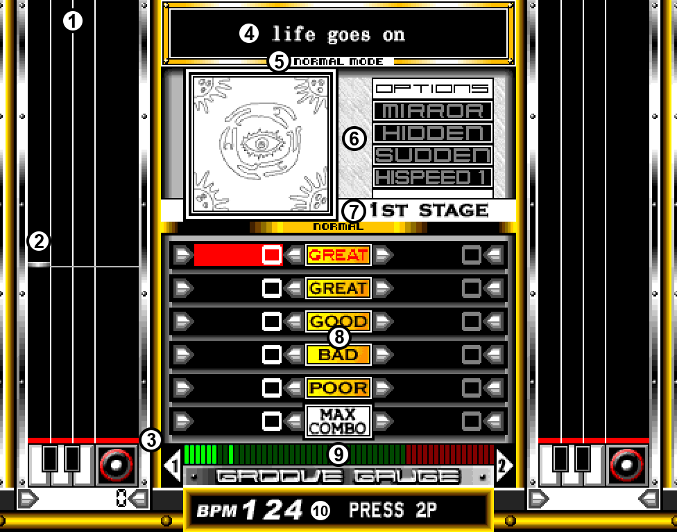

# Gameplay tutorial
{: .no_toc }

  

    Table of contents
  

  {: .text-delta }
1. TOC
{:toc}

While earlier games in the series contain a basic tutorial to get a feel for the controls, and all games contain a brief tutorial (usually in Japanese) during the attract screens, it's good to get a general idea of how the game is played first, if you've never seen either of them.

## Basic gameplay

Notes (white, blue, and red) scroll down from the top of the screen, to the bottom, reaching a red line. When they hit the red line, press the corresponding key to the rhythm.

- For the left, center, and right white notes, press the corresponding white keys.
- For the left and right blue notes, press the corresponding blue keys.

When a red note reaches the red line, scratch the turntable by pushing it forwards or backwards. If multiple red notes appear back to back, scratch back and forth.

- Only scratch once if a single note appears; if you scratch back, it will count as if you scratched it twice.

Hitting notes gives you a judgement based on how accurate you were, with the most accurate being a 'flashing' Great, and the least accurate being a Bad. Missing a note or pressing too late/early results in a Poor.

Getting flashing Greats, regular Greats and Goods fills up your Groove Gauge, seen at the bottom of the screen. Getting Bads, Poors, and missing notes depletes the gauge. To clear the song, you must get the gauge to the red zone at the end of the gauge, and keep it there before the song is over. If it is only in the green zone and the song ends, you fail, and the game is over, requiring you to insert another coin to continue.

## Gameplay screen information

1. Playfield (where notes come down from)
2. A white note, approaching the red line
3. Red line (where you must hit the note)
4. Song title
5. Current game mode
6. Current modifiers selected
7. Current stage
8. Judgement counter
9. Groove Gauge
10. Current BPM
